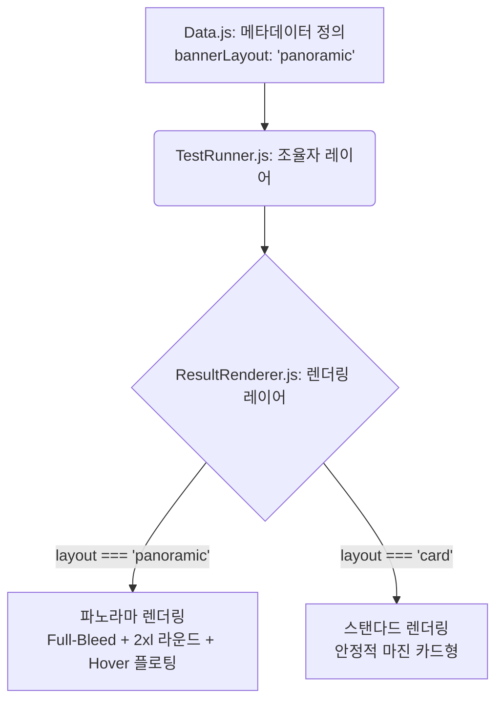

<!-- 파일 기능 서술 -->
> **문서 기능 (Document Function):** 본 문서(`result-page-architecture-guideline.md`)는 심리테스트 결과 페이지의 프론트엔드 UI/UX 설계 기조와, FSD 코어 엔진 기반의 데이터 주입(Design-Data Pattern) 렌더링 아키텍처를 총망라한 **단일 진실 공급원(SSOT)** 입니다. 모든 에이전트는 기획/디자인/엔지니어링 작업 시 본 문서를 최우선으로 준수해야 합니다.

# Mellow Wave 결과 페이지 마스터 아키텍처 지침서

최고 디자이너의 트렌디하고 미학적인 시각과, 데이터 아키텍처 디렉터의 무결성(FSD/OCP) 중심 설계 철학을 융합하여 도출된 마스터 가이드라인입니다. 시스템의 유지보수성과 시각적 극대화를 동시에 달성하기 위한 기계적이고 치밀한 규약을 명세합니다.

---

## 1. 결과 페이지 기본 UI 레이아웃 (Layout Architecture)

결과 페이지는 극강의 심미성과 각 테스트별 독창적인 컨셉을 담아내며, 스크롤 동선에 따라 4가지 메인 섹션으로 구성됩니다.

1. **결과 아트워크 및 타이포그래피 섹션**
   - 테스트 결과에 따른 메인 아트워크(WebP 기반)와 유형명이 출력됩니다.
   - 제목(`.result-title`)은 뷰포트를 불문하고 최대한 한 줄 내에 렌더링(`whitespace-nowrap`, `tracking-tighter`)되어야 합니다.
2. **결과 서사(Description) 및 능력치 섹션**
   - 200~400자 이내의 레이아웃 블로킹 없는 깔끔한 텍스트 배치 및 동적 능력치 바 렌더링.
3. **공유 및 내비게이션 섹션 (Above the Fold 최적화)**
   - 공유 버튼(Inline SVG 벡터 로고 사용) 및 메인 라우팅 액션 버튼.
4. **추천 섹션 및 유틸리티 광고 (Interstitial / Inline)**
   - 스폰서 광고 및 하단 추천 배너(Hot Contents) 영역.

---

## 2. 디자인-데이터 패턴 통합 렌더링 (Design-Data Strategy Injection)

과거 FSD 분리 작업 중 발생한 "모든 추천 배너가 박스형 카드(Card)로 획일화되는 결함(Regression)"을 타파하기 위해, 엔진 소스에 `if/else` 분기를 넣는 하드코딩을 배제하고 **전략 패턴 인젝션(Strategy Injection)**을 채택했습니다.

### 2-1. 아키텍처 흐름 다이어그램 (Data Lineage)



### 2-2. 다형성 구현 명세 (Implementation Rules)
1. **콘텐츠 레이어 (Data.js)**: 순수 데이터 파일이 자신의 레이아웃 속성을 선언합니다.
   ```javascript
   export const islandMetaData = { testId: 'island', bannerLayout: 'panoramic' };
   ```
2. **로직 조율자 (TestRunner.js)**: `initResultStrategy` 에서 메타데이터의 `layout` 옵션을 렌더러로 주입(Inject)합니다.
3. **렌더링 레이어 (ResultRenderer.js)**: 수신한 옵션에 따라 HTML Class를 하이브리드 동적 할당합니다.
   - **Panoramic 템플릿**: 좌우 여백을 찢는 `w-full`의 넓은 뷰포트 장악력을 유지하면서, 시각적 분리를 위한 좁은 간격(`gap-1 px-1`), 모바일 친화적 `rounded-2xl`, 그리고 반응형 `hover:-translate-y-1 hover:shadow-lg` 물리 애니메이션을 가미한 최상위 디테일 집약체입니다.

---

## 3. 퍼포먼스와 최적화 규약 (Performance & Optimization)

### 3-1. CSS-Only Background 및 자산 최적화
- 무거운 통짜 이미지 백그라운드 사용을 엄격히 금지합니다.
- `themes/[테마명].css` 내 네이티브 브라우저 렌더링(CSS Gradients) 혹은, 모바일 GPU 과부하를 막기 위해 Python 스크립트로 **사전 구워낸 베이크 텍스쳐(Pre-baked WebP)**를 병합해 1회의 HTTP Request로 극강의 최적화를 이뤄냅니다.

### 3-2. 로딩 전면 스크린 (Interstitial Ad Flow & Prefetching)
- 테스트 종료 시 즉각 렌더링 시 발생하는 CLS(Cumulative Layout Shift)를 막고 심리적 몰입감을 배가하기 위해, 문항의 후반부(Idle Time)에 **추천 배너 이미지를 Background Prefetching** 합니다.
- 이후 100vh 전면 광고 로딩 스크린(`lock-overlay`등)에서 최소 3초 이상 체류를 유도하여 데이터 파이프라인(Telemetry API)의 안정적 비동기 로드 시간을 벌어줍니다. (차후 google 광고와 병렬 조치 될 수 있습니다.)

---

## 4. 미학 및 아트워크 에셋 원칙 (Artistic Integrity)

### 4-1. 다이나믹 스탠다드 및 프롬프트 일관성 (Base Reference)
- 결과 캐릭터 이미지는 1개의 철저한 Base Reference Seed를 100% 반영하여 복제(Generation)되어야 합니다.
    *다만 성별의 차이, 캐릭터성을 살리기 위한 일관된 그림채의 다른 모습은 예외처리로 허용 됩니다.*
- 무표정 렌더링을 지양하며, 각 테스트 Кон셉(Island 등)과 성향에 완벽히 동기화된 행동(Dynamic Action), 표정, 시그니처 소품을 표현해야 합니다.
- 한 세트 내의 캐릭터들은 동일한 배경의 *식생 무드를 유지*하되 배경과 구도는 달라져야 합니다(Absolute Consistency).

---

## 5. Chapter별 기록 사항 (Revision History)

- **[수정일 2026-02-18]**: `결과_페이지_구성에_관해.txt` 초안을 바탕으로 FSD 모듈 분리 전, 결과 페이지의 기초적인 심미성 및 공유/로딩 규약을 설계.
- **[수정일 2026-02-28]**: 
  - **무엇을 변경했나**: 기존 `02_architecture/system`의 가이드라인과 `03_design`의 파노라마 롤백 문서를 본 파일 1개로 완전 스쿼시(Squash) 병합.
  - **어떻게 변경했나**: 데이터 공학적 다형성 패턴(Strategy Injection) 명세를 통합 문서 2장에 재배치하고, 세부 CSS 규격 제어를 엔지니어링 룰로 승격.
  - **왜 변경했나 (철학)**: 총괄 수석 엔지니어 규칙('가장 클린한 단일 진실 문서 SSOT') 및 디자인 수정 내역(Regression -> Rollback -> Hybrid Tuning)의 역사적 맥락 파편화를 막아, 추후 다른 개발 에이전트가 단 한 장의 문서만 읽어도 시스템의 렌더링 구조와 철학을 오차 없이 이식할 수 있도록 통일성을 강제함.

> _"디자인의 아름다움은 그 이면을 떠받치는 단단하고 유연한 데이터 공학 구조 위에서 가장 찬란히 꽃피웁니다. 이 문서는 그 토대를 정의합니다." - Total Director (General Engineer)_
